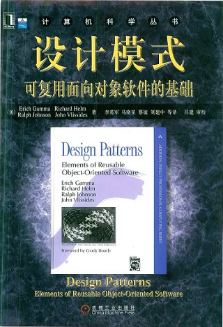

# 概述
## 面向对象
### 特性
封装、继承、多态

### 目标
设计出**高内聚、低耦合**的应用程序，最大程度的实现程序的复用，以应对复杂的需求变化。

## 设计原则

单一职责原则、依赖倒置原则、开闭原则、接口隔离原则、里氏替换原则、合成复用原则、迪米特原则

## 设计模式
### 模式
模式就是对前人积累的经验的抽象和升华。简单地说，就是从不断重复出现的事件中发现和抽象出规律，并解决同一类问题的经验总结，在软件工程领域中的模式可分为三个层次。

- **惯用法**：
最底层，语言相关，如引用计数，智能指针，垃圾收集等。
- **设计模式**：
中层，语言无关，如工厂模式，策略模式等。

- **架构模式**：
最高层，语言无关，用于高层决策，实现架构复用，如C/S架构，B/S架构，微服务架构等。

设计模式根据其目的可分为创建型，结构型和行为型三种类型。

### 分类
- **创建型**
创建型模式主要用于创建对象，主要有工厂方法模式、抽象工厂模式、单例模式、建造者模式、原型模式。

- **结构型**
结构型模式主要用于处理类或对象的组合，主要有适配器模式、装饰器模式、代理模式、外观模式、桥接模式、组合模式、享元模式。

- **行为型**
行为型模式主要用于描述对类或对象之间的交互及职责分配，主要有策略模式、模板方法模式、观察者模式、迭代器模式、责任链模式、命令模式、备忘录模式、状态模式、访问者模式、中介者模式、解释器模式。

