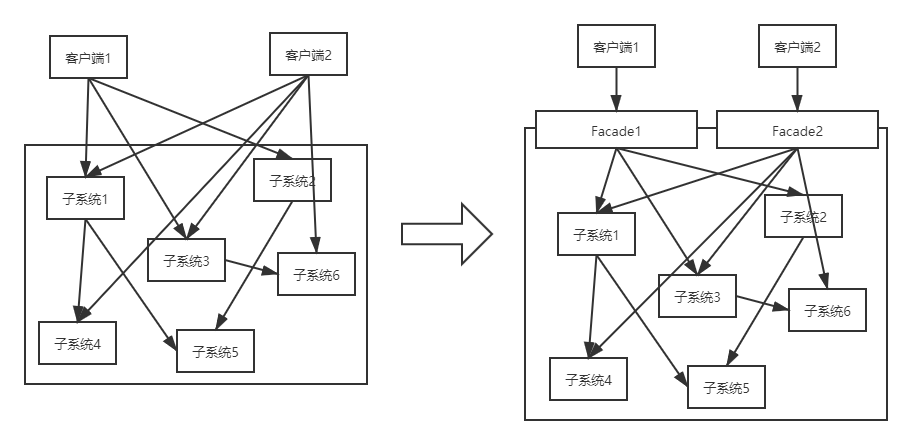
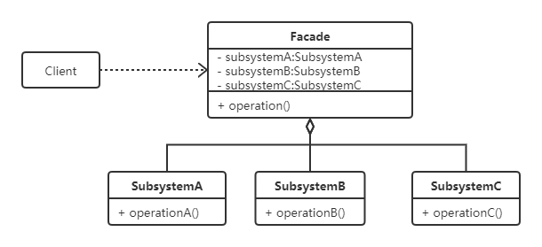

# 外观模式

## 定义
为子系统中的一组接口提供一个一致的界面，外观模式定义了一个高层接口，这个接口使得这一子系统更加容易使用。

外观模式跟代理模式类似，也更偏向于架构模式，常见于企业应用集成中，企业应用集成包括界面集成，业务流程集成（过程集成），控制集成（应用集成，API集成），数据集成四个层面，都与外观模式有密切关系。

## UML类图

## 目的
1. 为一个复杂的模块或子系统提供一个一致的外界访问接口，降低客户端访问子系统的复杂度。
2. 使客户端与子系统之间解耦，让子系统内部模块更易维护和扩展。
3. 进行访问控制，提高系统安全性。
4. 维护大型遗留系统。

## 和代理模式之间的异同
### 相同点
- 都可以在不改变子系统代码的基础上，对子系统加以控制；
- 原有系统之间都是可以直接访问的，两个模式都是为了让子系统更加容易使用；
- 都不应该在其中添加子系统没有的功能。

### 不同点
- 外观模式面向的是多个不同的子系统，而代理模式通常面向的是一个（或者多个相同的）子系统。
- 外观模式更多强调是对多个子系统的整合，而代理模式更多强调的是对某个子系统的代理。

极端情况下，假如外观模式中的子系统只有一个，就跟代理模式差不多了，这有点像抽象工厂模式和工厂方法模式之间的关系。

## 思考
首先， DDD中的Service层是外观模式，因为它封装了下层的Repository，让上层更容易使用，同时上层也可以直接访问Repository层。那么，MVC中的Controller层，三层架构中的BLL层，微服务中的网关是不是外观模式呢？
1. Controller不算外观模式，因为Controller虽然封装了Service层，但Service层本身不能被用户直接访问；
2. BLL层也不算外观模式，虽然从代码上看，他跟DDD中的Service层非常相似，甚至完全一样，但三层架构是横向切分，而DDD是纵向切分，他们从设计思想上有本质的区别。在三层架构中，虽然上层也可以直接访问DAL层，但这种操作在设计上是不被允许的；
3. 网关中用到了外观模式，网关比较复杂，其中大量用到了外观模式，但不等于外观模式。

当然，在具体开发过程中，没必要过分拘泥于这些细节，满不满足外观模式的定义并不是好的设计的必要条件。