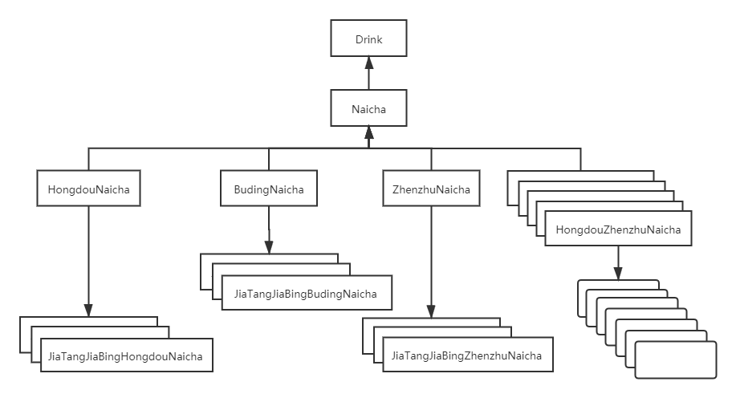
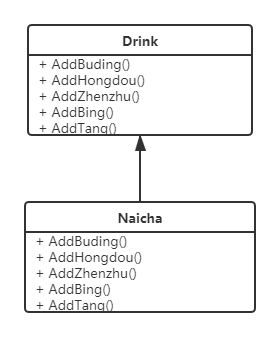
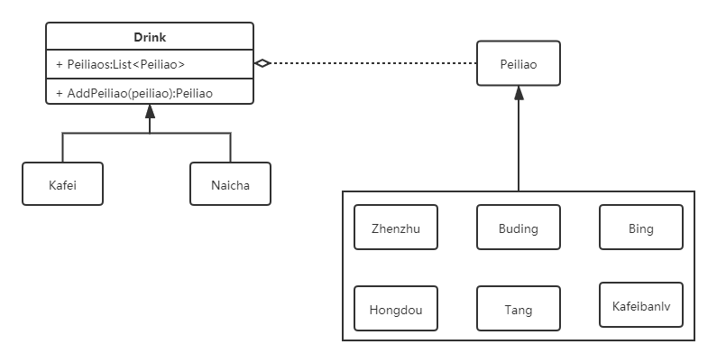
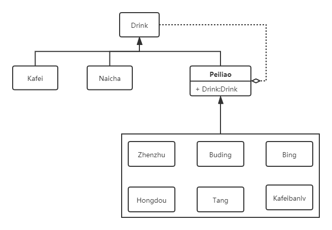
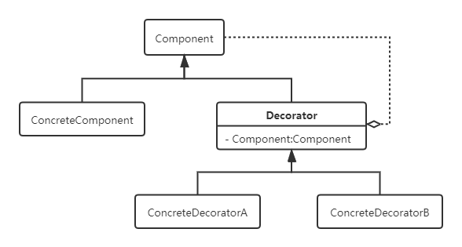
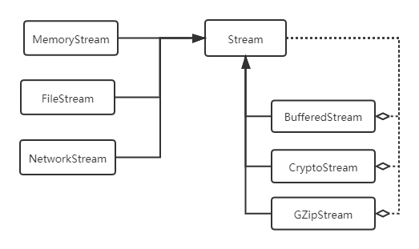

# 装饰器模式
## 示例
### 需求
假设开一个奶茶店，奶茶种类繁多，如红豆奶茶，布丁奶茶，珍珠奶茶，红豆珍珠奶茶等，并根据不同配料计算价格，并且根据每个客户的要求，每种奶茶又可以加糖或者加冰，加糖加冰不额外收费。

### 初级方案

#### 问题
- 类爆炸
- 如果加冰改为收费，需要多处修改价格，代码维护困难，严重违反开闭原则
- 如果新增配料，类的数量会急剧增加，代码维护困难，严重违反开闭原则
- 无法实现加多份配料，如多冰、多糖等；

### 改进一

#### 优点
- 消除了类爆炸的问题，代码简洁
- 可以任意搭配组合

#### 缺点
- 需要修改奶茶的基类和实现类，违反了开闭原则；
- 修改价格或新增配料需要新增方法，同样违反开闭原则；
- 新增饮品咖啡，咖啡不需要布丁、珍珠、红豆等，但是需要冰和糖，同时需要咖啡伴侣，这时会变得麻烦。

### 改进二

#### 优点
- 可任意搭配组合，并且满足新增饮品的需求
- 新增饮品和配料均只需要增加新的类即可，满足开闭原则

#### 缺点
- 依然需要修改饮料类，这在很多时候是不被允许的，或者说做不到的；
- Add方法不合理，饮料不应该具有添加配料的能力。

### 改进三

通过组合+继承的方式改进，可使得饮品的扩展更灵活，同时也遵守了开闭原则。其中，组合是为了实现功能，而继承是为了约束类型，这其实就是装饰者模式。

## 定义
装饰器模式**动态地给一个对象增加一些额外的职责**。就增加功能而言，装饰器模式比生成子类更为灵活。

## UML类图

## 优缺点
### 优点
- 可动态的给一个对象增加额外的职责
- 有很好地可扩展性
### 缺点
- 增加了程序的复杂度，刚接触理解起来会比较困难

## 跟代理模式的区别
装饰器模式跟代理模式类图基本一样，但是，它们之间却有很大的区别：
- 装饰器模式关注于在一个对象上动态的添加方法，而代理模式关注于控制对对象的访问。
- 装饰器模式通常用聚合的方式，而代理模式通常采用组合的方式。
- 装饰器模式通常会套用多层，而代理模式通常只有一层。
但是由于他们的结构十分相似，因此很多时候二者可以做同样的事，比如装饰器模式和代理模式都可用于实现AOP（面向切面编程）。

## 经典案例
在.NET类库中，`System.IO.Stream`就是装饰者模式的一个经典案例，不过在这个案例中没有用到Decorator基类。

