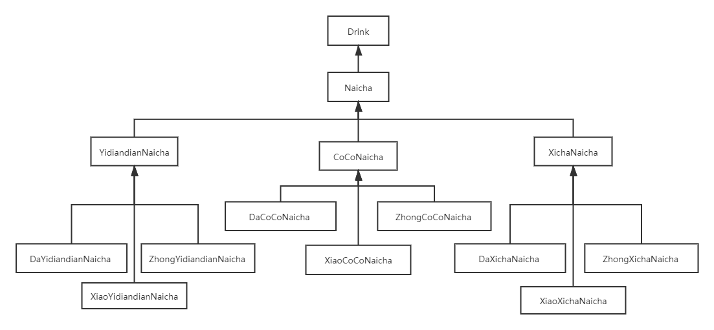
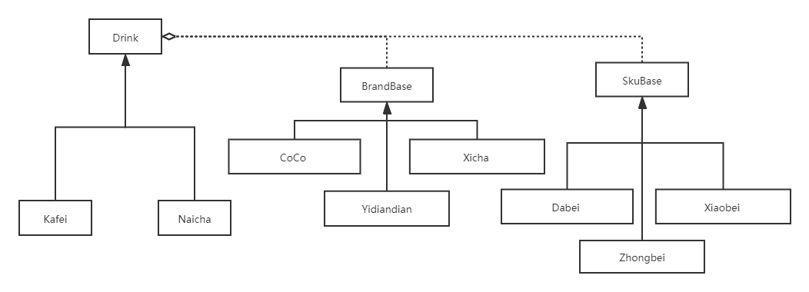

# 桥接模式

## 示例
### 需求
还是以奶茶店为例，奶茶有很多品牌，如，一点点，COCO，喜茶等，奶茶的规格又分为大杯、中杯、小杯等，不同品牌价格不同，不同规格价格也不同（不考虑太复杂的情况，就假设每种品牌和规格都有一个价格基数，总价直接累加）。

### 初级方案

#### 问题
- 类爆炸
- 大量代码重复
- 如果增加品牌，或者调整规格价格，代码维护困难，严重违反开闭原则。

### 思考
1. 考虑能否使用装饰器模式实现？
2. 这里的品牌、规格跟装饰器模式中用到的配料有什么区别？

## 改进

## 简化UML

## 定义
桥接模式是将抽象部分与它的实现部分分离，使它们都可以独立地变化。

**Abstraction**：抽象化角色，并保存一个对实现化对象的引用。
**RefinedAbstraction**：修正抽象化角色，改变和修正父类对抽象化的定义。
**Implementor**：实现化角色，这个角色给出实现化角色的接口，但不给出具体的实现。
**ConcreteImplementor**：具体实现化角色，这个角色给出实现化角色接口的具体实现。

## 优缺点
### 优点
- 分离抽象部分与它的实现部分
- 相对于继承有更少的子类，使用更灵活，也更易扩展，可多个维度自由扩展

### 缺点
- 增加系统的理解与设计难度
- 独立变化的维度的识别比较困难
- 客户端使用成本较高

## 跟装饰器模式的区别
- 装饰器模式是为了动态地给一个对象增加功能，而桥接模式是为了让类在多个维度上自由扩展；
- 装饰器模式的装饰者和被装饰者需要继承自同一父类，而桥接模式通常不需要；
- 装饰器模式通常可以嵌套使用，而桥接模式不能。
