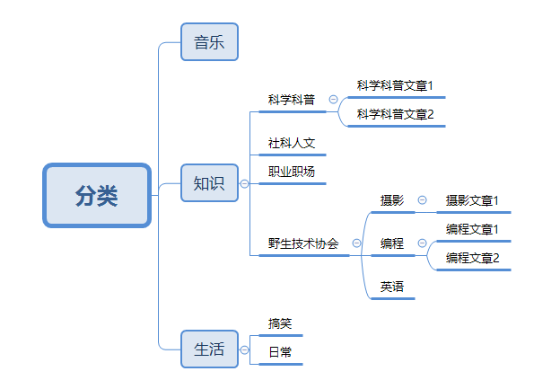
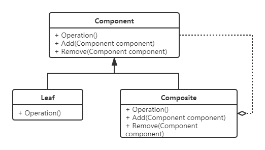

# 组合模式

## 定义
将对象组合成**树形结构**以表示“部分-整体”的层次结构。组合模式使得对单个对象和组合对象的使用具有一致性。

## 示例

## UML类图

- **Component**：组合中的对象声明接口，并实现所有类共有接口的默认行为。
- **Leaf**：叶子结点，没有子结点。
- **Composite**：枝干节点，用来存储管理子节点，如增加和删除等。

## 应用实例
文件系统中的文件与文件夹、Winform中的简单控件与容器控件、XML中的Node和Element等。

### 透明模式
透明模式是把组合使用的方法放到抽象类中，使得叶子对象和枝干对象具有相同的结构，客户端调用时具备完全一致的行为接口。但因为Leaf类本身不具备Add()、Remove()方法的功能，所以实现它是没有意义的，违背了单一职责原则和里氏替换原则。

### 安全模式
安全模式是把枝干和叶子节点区分开来，枝干单独拥有用来组合的方法，这种方法比较安全。但枝干和叶子节点不具有相同的接口，客户端的调用需要做相应的判断，违背了依赖倒置原则。

## 优缺点
### 优点
- 客户端调用简单，可以像处理简单元素一样来处理复杂元素,从而使得客户程序与复杂元素的内部结构解耦。
- 可以方便的在结构中增加或者移除对象。

### 缺点
- 客户端需要花更多时间理清类之间的层次关系