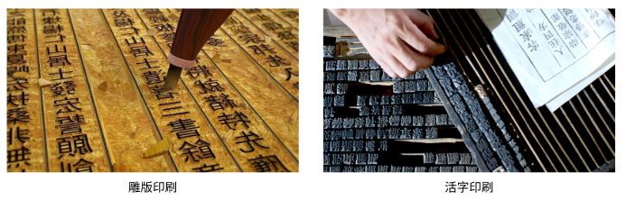
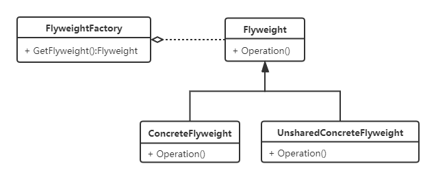

# 享元模式
## 定义
运用共享技术有效地支持大量细粒度的对象。

## 适用场景
- 系统会用到大量相同或相似的对象；
- 对象创建比较耗时。

## 目的
- 减少创建对象的数量；
- 对象全局共享。

## 示例

## UML类图

- **FlyweightFactory**：享元工厂，用来创建并管理Flyweight对象
- **Flyweight**：享元类的基类或接口
- **ConcreteFlyweight**：具体的Flyweight子类
- **UnsharedConcreteFlyweight**：不需要共享的Flyweight子类

## 应用实例
字符串驻留池、线程池、数据库连接池等。

## 优缺点
### 优点
- 节省内存空间
- 提高效率

### 缺点
增加了系统的复杂度。

## 与单例模式的区别
- 享元模式是共享大量类的大量实例，而单例是一个类一个实例；

- 单例模式针对的是对象的创建，而享元模式针对的是对象的管理；

- 单例模式不能单独创建，而享元模式可以单独创建。

## 与简单工厂模式的区别
- 享元模式在简单工厂模式的基础上加入了缓存；
- 简单工厂模式的作用仅仅是创建对象，而享元模式虽然也创建对象，但其主要作用是管理对象。