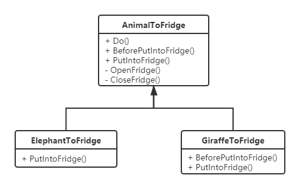
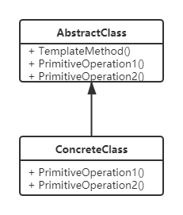

# 模板方法模式
## 定义
定义一个操作中的算法的框架，而将一些步骤延迟到了子类中。使得子类可以不改变一个算法的结构即可重定义该算法的某些步骤。

## 实例
来一个经典的脑筋急转弯。
1. 把一个大象装进冰箱要几个步骤？
2. 然后把一个长颈鹿装进冰箱要几个步骤？

## UML类图

## 钩子函数
钩子就是给子类一个授权，让子类来可重定义模板方法的某些步骤，说白了就是虚函数。

## 优缺点
### 优点
- 封装了算法骨架，提高了代码复用性，简化了使用难度；
- 封装不变部分，扩展可变部分，满足开闭原则。

### 缺点
- 算法骨架不易更改；
- 扩展时，可能会产生很多子类。

## 跟建造者模式的异同
