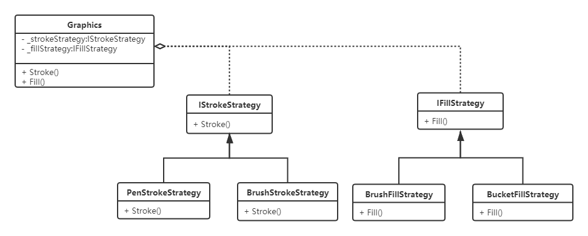
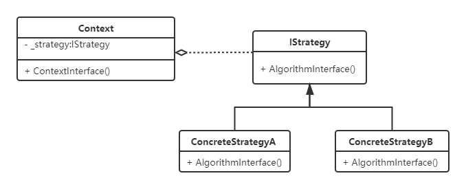

# 策略模式
## 示例

## 定义
定义一系列算法，把他们一个个封装起来，并且使他们可以互相替换。该模式使得算法可以独立于使用它的客户程序而变化。

## UML类图

- **Context**：策略上下文，持有`IStrategy`的引用，负责和具体的策略实现交互；
- **IStrategy**：策略接口，约束一系列具体的策略算法；

- **ConcreteStrategy**：具体的策略实现。

## 优点
- 策略可以互相替换；
- 解决`switch-case`、`if-else`带来的难以维护的问题；
- 策略易于扩展，满足开闭原则.
## 缺点
- 随着策略的扩展，策略类数量会增多；
- 客户端必须知道每一个策略类，增加了使用难度。

## 应用场景
促销活动，日志、缓存等