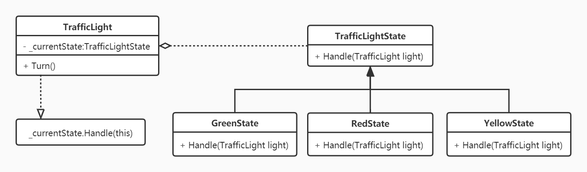
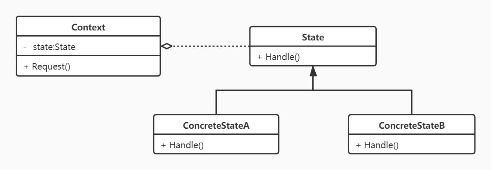

# 状态模式
## 示例
实现一个交通灯调度程序，灯的颜色需要在红灯->绿灯->黄灯->红灯之间循环转换，但是不允许绿灯->红灯或黄灯->绿灯等情况。

## 有限状态机
有限状态机的工作原理是，发生**事件(event)**后，根据**当前状态(cur_state)**，决定执行的**动作(action)**，并设置**下一个状态(nxt_state)**。

## 定义
允许一个对象在其内部状态改变时改变它的行为，从而使对象看起来似乎修改了它的类。

## UML类图

- **Context**：上下文环境，定义客户程序需要的接口，并维护一个具体状态角色的实例，将与状态相关的操作委托给当前的 `ConcreteState`对象来处理；

- **State**：抽象状态,定义特定状态对应行为的接口；

- **ConcreteState**：具体状态，实现抽象状态定义的接口。
## 优缺点
### 优点
- 解决`switch-case`、`if-else`带来的难以维护的问题；
- 结构清晰，提高了扩展性；
- 通过单例或享元可使状态在多个上下文间共享。

### 缺点
- 随着状态的扩展，状态类数量会增多；
- 增加了系统复杂度，使用不当将会导致逻辑的混乱；
- 不完全满足开闭原则。

## 与策略模式区别
### 策略模式
- 强调可以互换的算法；
- 用户直接与具体算法交互，决定算法的替换，需要了解算法本身；
- 策略类不需要持有**Context**的引用。

### 状态模式
- 强调改变对象内部的状态来帮助控制自己的行为；
- 状态是对象内部流转，用户不会直接跟状态交互，不需要了解状态本身；
- 状态类需要持有**Context**的引用，用来实现状态转移。
