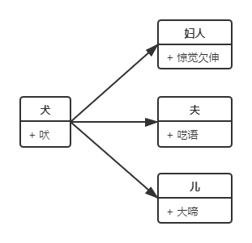
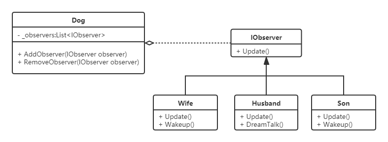
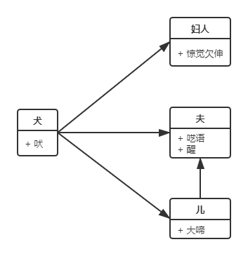
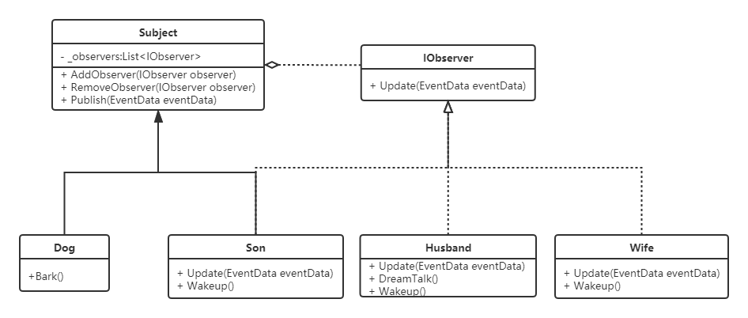
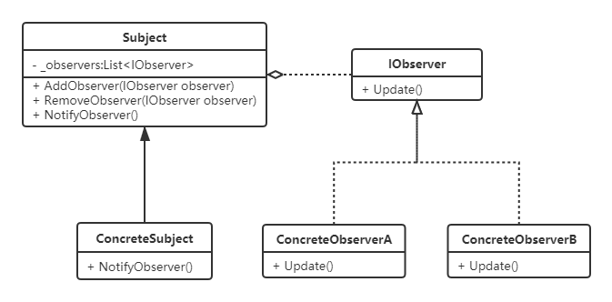
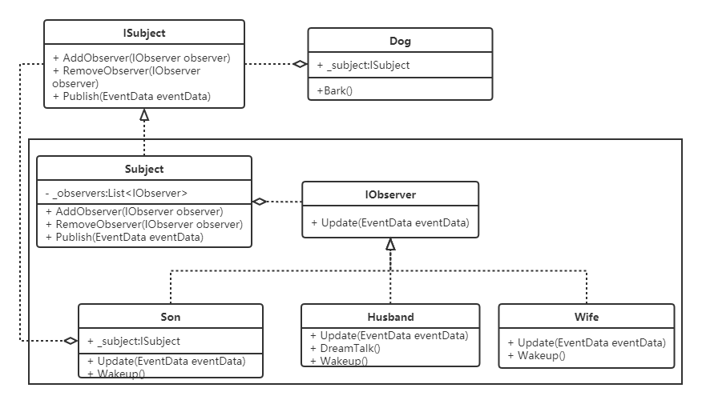
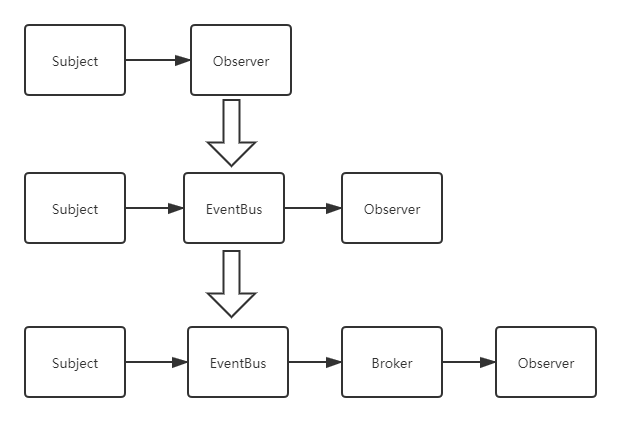

# 观察者模式
## 示例
在中学阶段有一篇课文《口技》，其中有一句“遥闻深巷中犬吠，便有妇人惊觉欠伸，其夫呓语。既而儿醒，大啼。”

### 角色关系

## 实现
### 出版实现
见代码

### 演进一-简易观察者模式

既然观察者实现了一个抽象的接口，那么被观察者理所应当也应该实现一个抽象的接口啊，但是该实现接口还是继承抽象类呢？

### 演进二
加入新需求，翻翻课本可以看到，“遥闻深巷中犬吠，便有妇人惊觉欠伸，其夫呓语。既而儿醒，大啼。”，后面还有三个字“夫亦醒。”

依据这些，我们可以分析出以下三点：
1. 被观察者有两个，一个是狗，一个是儿子；
2. 丈夫观察了两件事，一个是狗叫，一个是儿子哭；
3. 儿子既是观察者，又是被观察者。

两个问题：
1. `Dog`和`Son`中存在着大量重复的代码；
2. 运行一下会发现`Husband`的功能没有实现。

### 演进三-标准观察者模式

## 定义
多个对象间存在一对多的依赖关系，当一个对象的状态发生改变时，所有依赖于它的对象都得到通知并被自动更新。
### UML类图

- **Subject**：抽象主题角色，它是一个抽象类(而实际上我用的是普通类)，提供了一个用于保存观察者对象的集合和增加、删除以及通知所有观察者的方法。
- **ConcreteSubject**：具体主题角色。
- **IObserver**：抽象观察者角色，它是一个接口，提供了一个更新自己的方法，当接到具体主题的更改通知时被调用。
- **Concrete Observer**：具体观察者角色，实现抽象观察者中定义的接口，以便在得到主题的更改通知时更新自身的状态。

## 优缺点
### 优点
1. 降低了主题与观察者之间的耦合关系；
2. 主题与观察者之间建立了一套触发机制。
### 缺点
1. 主题与观察者之间的依赖关系并没有完全解除，而且有可能出现循环引用；
2. 当观察者对象很多时，事件通知会花费很多时间，影响程序的效率。

## 通知模式

### 推模式
由主题主动将事件消息推送给观察者，好处就是实时高效，这也是较为推荐的一种方式。
### 拉模式
并非所有场景都适合使用推模式，例如，某主题有非常多的观察者，但是每个观察者都只关注主题的某个或某些状态，这时使用推模式就不太合适了，因为推模式会将主题的所有状态不加区分的推送给所有观察者，对观察者而言，得到的消息就过于臃肿驳杂了。

## 演进四-事件总线
### 思考
1. 以下是观察者模式使用的两种典型场景，它们有何不同：
    - 报社订阅报纸
    - 黑板上发公告

2. 回顾前面例子中的两个问题
    - `dog.AddObserver(...)`真的合适吗？实际生活中，狗真的有这种能力吗？
    - 我们知道`C#`中不支持多继承，如果`Dog`本身继承自`Animal`的基类，如果同时作为被观察者，除了用上述演进一的实现，还能如何实现？

### 实现

### 演进五-MQ
### 思考
如果主题和观察者分属两个不同的系统该怎么办？

### Broker代理
主要包含如下几个组成部分：
1. 一个`Queue<EventData>`类型的队列，用于存放事件消息；
2. 一组注册和注销观察者的方法；
3. 一个接收来自事件发布者的事件消息的方法；
4. 最后就是事件消息的通知机制，这里用的是定时轮询的方式，实际应用中肯定不会这么简单。

### 演进过程

1. 第一阶段降低了主题与观察者之间的耦合度，但并没有完全解耦，这种情况主要应用在类似报纸订阅的场景；
2. 第二阶段在主题与观察者之间加了一条总线，使得主题与观察者完全解耦，这种情况主要运用在类似黑板广播消息的场景；
3. 第三阶段在总线与观察者之间加了一个代理，使得存在于不同系统之间的主题与观察者也能够解耦并且正常通信。

## .Net中的应用
1. 委托(`delegate`)和事件(`event`);
2. `.Net`中提供了一组泛型接口`IObserver<T>`和`IObservable<T>`可用于实现事件通知机制。

## 总结
事件无处不在，观察者模式也是无处不在的。