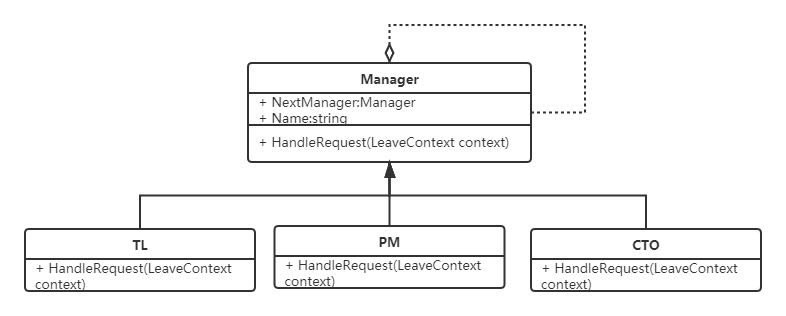
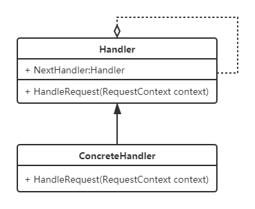

# 责任链模式
## 示例
用程序实现一个请假流程，根据请假天数不同，需要各级领导审批，例如，如果请假时长不超过1天，则直接团队负责人申请即可，超过1天不超过3天则需要项目经理审批通过才行，而超过3天不超过7天则需要CTO审批等等。

## 定义
多个对象都有机会处理某个请求，将这些对象连成一条链，并沿着这条链传递该请求，直到有对象处理它为止。

## UML类图

- **Handler**：抽象处理者角色，是一个处理请求的接口或抽象类；
- **ConcreteHandler**：具体的处理者角色，具体的处理者接收到请求后可以选择将请求处理掉，或者将请求传递给下一个处理者。

- **ConcreteStrategy**：具体的策略实现。

## 优缺点
### 优点
1. 请求和处理分离，请求者可以不用知道是谁处理的，处
理者可以不用知道请求的全貌，两者解耦，提高系统的灵活性；

### 缺点
1. 性能不高；
2. 调试不很方便。

