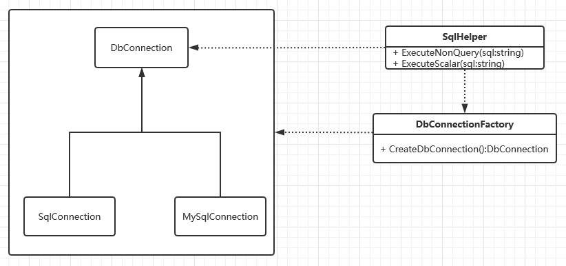
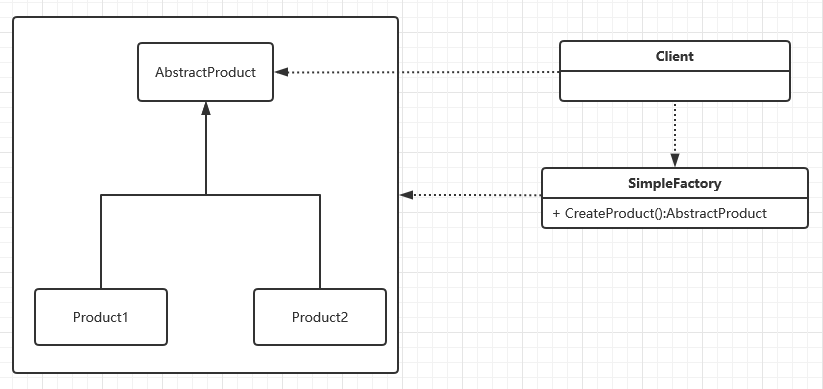
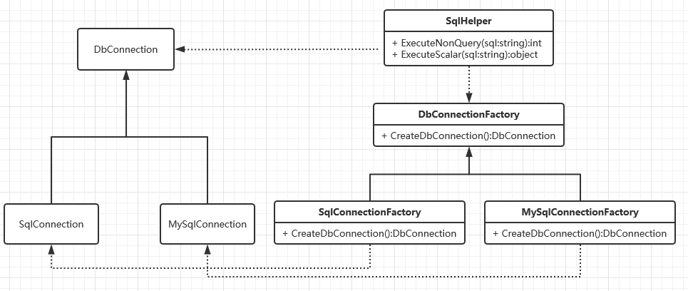
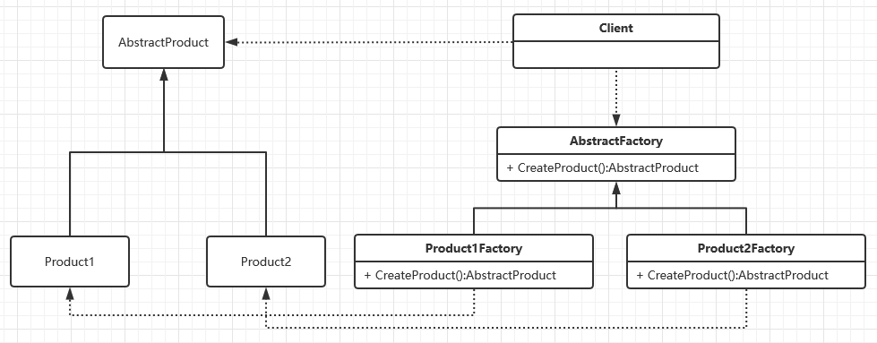
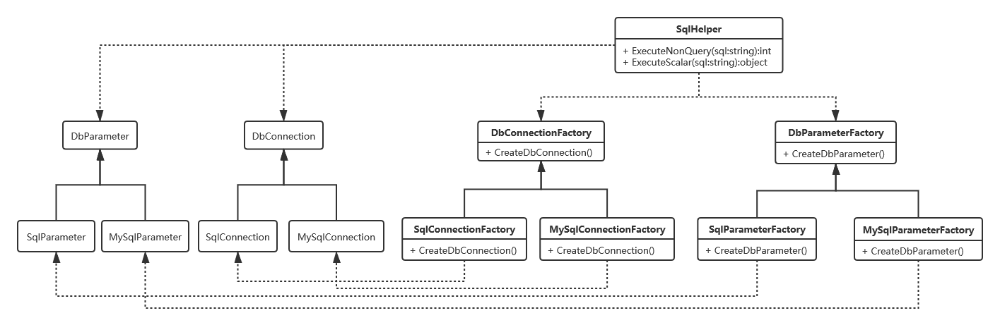
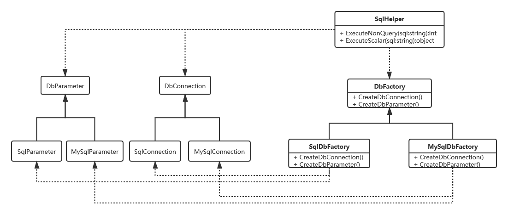
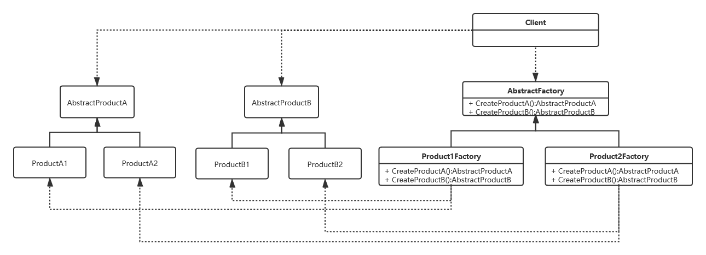

# 工厂模式
工厂顾名思义就是创建产品，本质就是用工厂方法代替`new`操作创建一种实例化对象的方式。根据不同的实现方式和抽象级别又可分为简单工厂，工厂方法和抽象工厂三种模式。
## 案例
### 需求
封装一个SqlHelper类，实现对SqlServer的操作，且后续可能需要同时支持SqlServer，MySql，Oracle等主流数据库。

### UML类图

## 简单工厂
### 定义
简单工厂又叫做静态工厂方法模式，但不属于23种GOF设计模式之一。简单工厂模式是由一个工厂对象决定创建出哪一种产品类的实例。

### UML类图

### 优缺点
- **优点**
    - 实现了对责任的分割，隔离了变化，因为它提供了专门的工厂类用于创建对象。
    - 通过配置文件，可以在不修改任何客户端代码的情况下更换和增加新的具体产品类，在一定程度上提高了系统的灵活性。

- **缺点**
    - 集中了所有实例的创建逻辑，违反了单一职责原则
    - 扩展困难，一旦添加新产品就不得不修改工厂逻辑，违反了开闭原则

## 工厂方法
### 案例改进

### 定义
定义一个工厂父类，工厂父类负责定义创建对象的公共接口，而子类则负责生成具体的对象。即将类的实例化延迟到工厂类的子类中完成，即由子类来决定应该实例化哪一个类。
### UML类图

### 优缺点
- **优点**： 符合设计原则
- **缺点**：类的个数成倍增加，增加了系统的复杂度

## 抽象工厂
### 扩展功能-参数化查询

- **问题**
    - 类的数量成倍增长
    - 无法保证类之间的依赖关系

### 改进

### 定义
抽象工厂是工厂方法的升级版，为相关或者相互依赖的对象提供一个统一的接口，而且无需指定他们的具体实现类。

### UML类图

### 优缺点
- **优点**
    - 对产品族进行约束，封装性好
- **缺点**
    - 产品族扩展困难，添加一个产品需要修改抽象和具体工厂类，违背开闭原则。