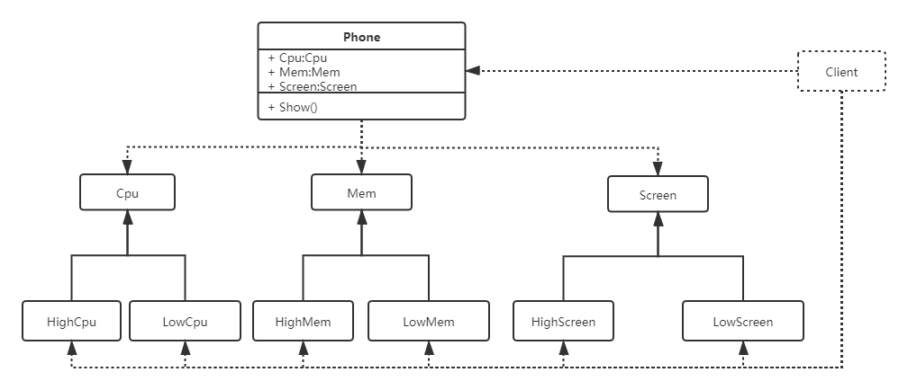
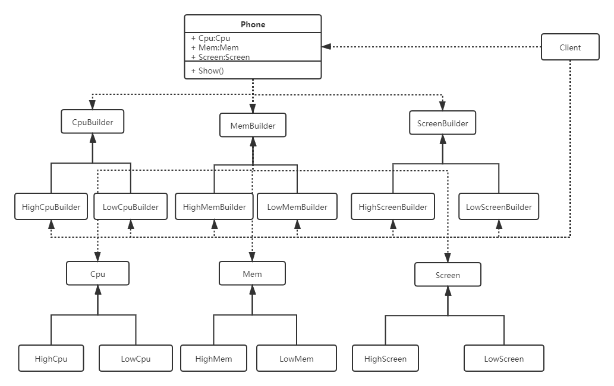
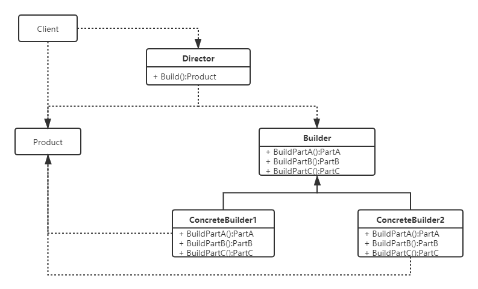
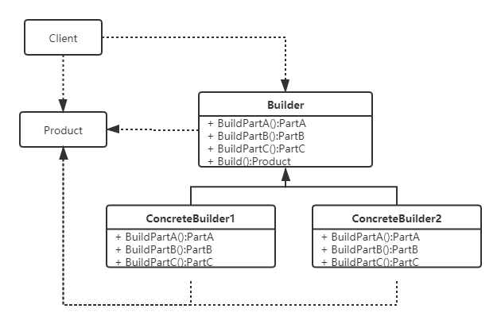
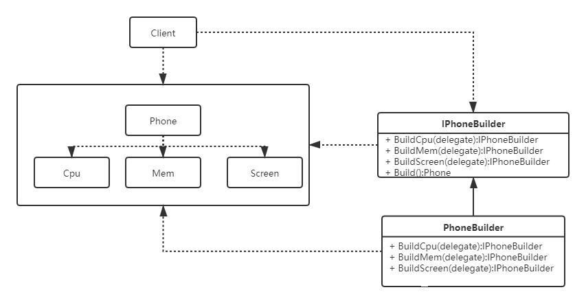

# 建造者模式
## 角色

- **建造者（Builder）**：不同种类的工人，如打地基的，建房梁的，室内装修的等；
- **具体的建造者（ConcreteBuilder）**：每个工种对应的具体的工人；
- **指挥者（Director）**：工程队总指挥，包工头，指挥具体的建造者建房子；
- **具体产品（Product）**：最终建成的房子。

## 定义
建造者模式是将一个复杂的对象的构建与它的表示分离，使得同样的构建过程可以创建不同的表示。创建者模式隐藏了复杂对象的创建过程，它把复杂对象的创建过程加以抽象，通过子类继承或者重载的方式，动态的创建复杂的、具有复合属性的对象。

## 案例
### 简化需求
构造一个手机，手机包括CPU，内存，屏幕等几个部分，而CPU，内存，屏幕配置不同又有高端，低端之分。要求手机配置可以灵活搭配。

### 初始版UML

#### 优点
简单，并且配置可灵活搭配

#### 缺点
- 面向了实现编程，用户需要知道太多的创建细节

### 工厂方法改造

#### 优点
- 屏蔽了配件的创造细节
- 配置可灵活搭配
#### 缺点
- 复杂度急剧增大，类爆炸
- 把配件的组装交给手机类(Phone)处理不合理
- 没有屏蔽手机创造细节

### 抽象工厂+简单工厂改造

### 简化UML(标准版本)

#### 优点
- 一定程度上，消除了类爆炸问题
- 职责分离，由单独一个生产线组装手机

#### 缺点
- 配件配置变得固定了，不能随意组合
- 对大多数场景依然过于复杂，比如，未必每一个配置的手机都需要一个生产线，组装手机也未必需要一个单独的生产线。

### 进一步简化

### 再进一步改造

### 简化UML(简化版本，最常用)

#### 优点
简单，灵活，代码优雅
#### 缺点
用户使用成本相对较高，需要使用者自己配置内部参数。
