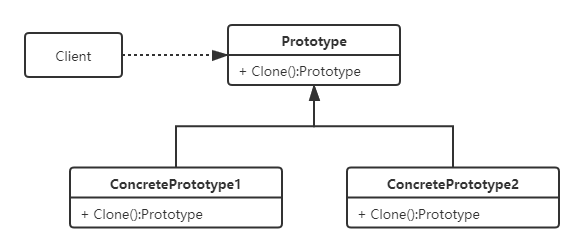

# 原型模式
## 定义
原型模式是用原型实例指定创建对象的种类，并通过拷贝这些原型创建新的对象。简单地说就是，首先创建一个实例，然后通过这个实例去拷贝（克隆）创建新的实例。

## 需求
通常情况下，找工作时，需要准备多份简历，简历信息大致相同，但是可以根据不同的公司的岗位需求微调工作经历细节，以及薪资要求。

## UML类图

## 使用场景
- 当需要重复创建一个包含大量公共属性，而只需要修改少量属性的对象时；
- 当需要重复创建一个初始化需要消耗大量资源的对象时。

## 优点
- 创建大量重复的对象，同时保证性能

## 浅拷贝与深拷贝
### 浅拷贝
1. 对于基本类型的成员变量，浅拷贝会直接进行值传递。
2. 对于引用类型的成员变量，比如数组、对象等，浅拷贝会进行引用传递。因此，在一个对象中修改该成员变量会影响到另一个对象的该成员变量值。
3. `Object.MemberwiseClone()`是浅拷贝。

### 深拷贝
1. 对于一个对象无论其成员变量是什么类型，都从内存中完整的拷贝一份出来,从堆内存中开辟一个新的区域存放新对象,且修改新对象不会影响原对象；
2. 对对象先序列化，再反序列化是深拷贝。

浅拷贝和深拷贝是相对的，如果一个对象内部只有基本数据类型，那么浅拷贝和深拷贝是等价的。

## 避免使用ICloneable接口
`ICloneable`接口只有一个`Clone()`成员方法，我们通常会用它充当`Prototype`基类来实现原型模式，但我这里要说的是尽量避免使用`ICloneable`，原因在 **《Effective C#:50 Specific Ways to Improve Your C#》** 一书中的**原则27** 有给出，基本思想如下：
1. 由于只有一个Clone方法，因此调用者无法区分到底是深拷贝还是浅拷贝，会给调用者造成极大的困扰；
2. 如果基类继承了`ICloneable`接口，并且非Sealed类型，那么它的所有派生类都需要实现Clone方法。否则，用派生类对象调用Clone方法，返回的对象将会是基类Clone方法创建的对象，这就给派生类带来了沉重的负担,因此在非密封类中应该避免实现 `ICloneable` 接口，但这个不是`ICloneable`特有的缺陷，任何一种方式实现原型模式都存在该问题，因此建议将原型模式的实现类设置为密封类。
3. Clone方法返回值是`object`，是非类型安全的；

`ICloneable`被很多人认为是一个糟糕的设计，其他理由如下：
1. `ICloneable`除了标识可被克隆之外，无论作为参数还是返回值都没有任何意义；
2. `.Net Framework`在升级支持泛型至今，都没有添加一个与之对应的`ICloneable<T>`泛型接口；
3. 很多框架中为了向下兼容，虽然实现了`ICloneable`接口，但是内部只提供了一个抛出异常的私有实现，例如`SqlConnection`。

鉴于上述诸多缺点，在实现原型模式时，`ICloneable`接口能不用就不要用了，自己定义一个更有意义的方法或许会更好。