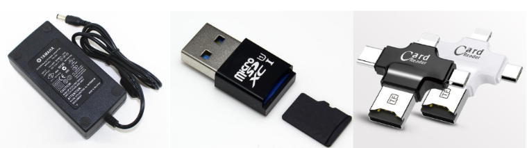
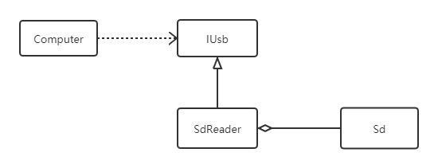

# 适配器模式
## 生活中的例子

生活中适配器无处不在。
## 定义
将一个类的接口转换成客户希望的另外一个接口。适配器模式将原本由于接口不兼容而不能一起工作的那些类可以一起工作。
## 示例
实现一个读卡器的例子。

### 案例分析
1. 通常我们电脑只有USB接口，不能直接插入SD卡；
2. 电脑和SD卡都是成型的产品，不可能改造。
3. 因此，我们需要在中间实现一个转换器，也就是读卡器。

### 案例类图

## UML类图

## 角色

- **目标接口**：Target，我们期望的接口
- **适配器**： Adapter, 将被适配者转换成我们期望的形式
- **被适配者**: Adaptee 原有的接口

## 优缺点
### 优点
1. 可以让任何两个没有关联的类一起运行。
2. 提高了类的复用。
3. 通过引入一个适配器类来重用现有的类，而无须修改原有结构，遵守了开闭原则

### 缺点
过多地使用适配器，会让系统非常零乱，不易整体进行把握。

## 总结
适配器模式属于补偿机制，专门用来在系统后期扩展、修改时使用。因此，适配器模式也不宜过度使用，如果可以的话，我们应该优先通过重构解决。