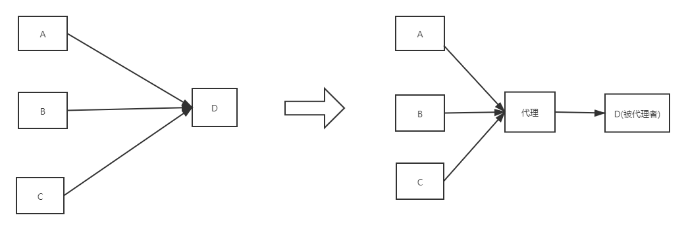
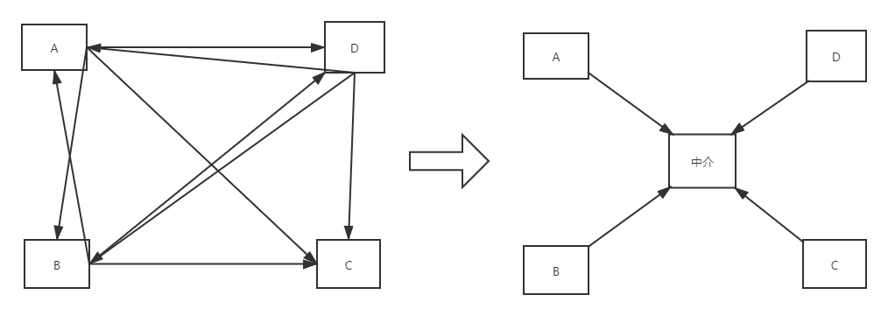

# 代理模式
## 概念界定
委托、代理、中介
### 委托(Delegate)
委托是一种引用方法的类型,相当于`C++`里的函数指针。
### 代理(Proxy)

见他如见我就叫代理，产品代理商，代购，租房代理
### 中介(Mediator)

中间搭桥就是中介，最终双方还是要见面，租房中介，婚姻中介
## 定义
为其他对象提供一种代理以控制对这个对象的访问。

## 使用场景
Windows快捷方式，VPN，防火墙，RPC调用，科学上网等。

## 目的
1. 在不改变原有代码的基础上，对原有类加以控制；
2. 访问由于某种原因不能直接访问或者直接访问困难的第三方组件或中间件。

## UML类图

## 和适配器比较
1. 适配器模式的目的是接口转换，使原本不兼容而不能一起工作的类可以一起工作；
2. 代理模式的目的是间接访问和访问控制；
3. 适配器模式面向的是不能一起工作的两个类，而代理模式是面向原本可以一起工作的两个类。

## 总结
随着系统复杂度的发展，代理模式更偏向于是一种架构模式，在各种框架中以及与各种中间件交互是是非常常见的，而在我们自己的代码中反而很少见了，它更多的体现的是一种思想，而非代码实现。